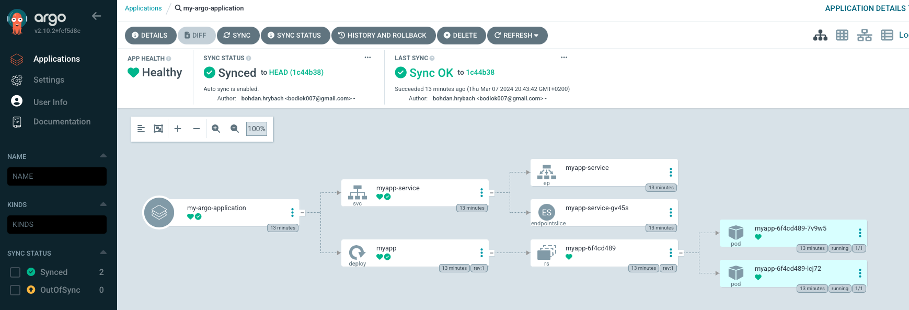
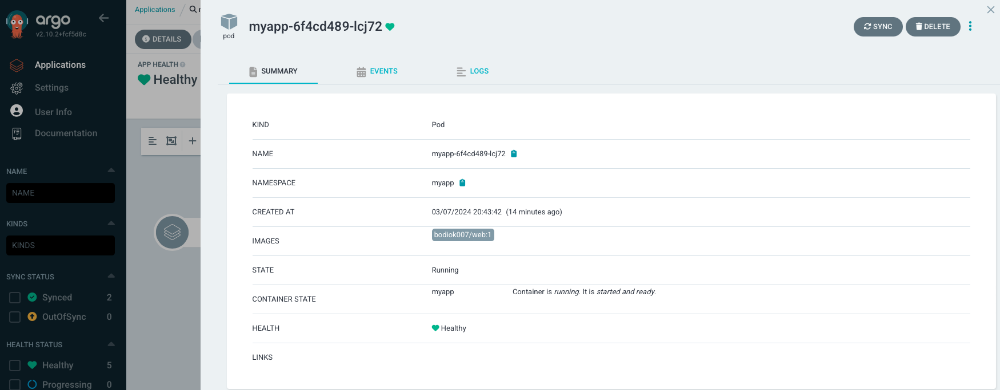
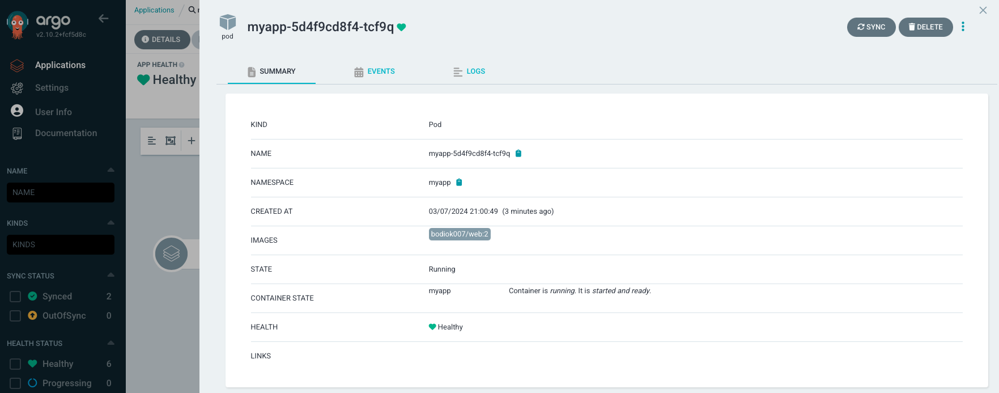

# ArgoCD

1. Install kubectl

```
curl -LO 'https://dl.k8s.io/release/v1.22.0/bin/linux/amd64/kubectl'
curl -LO "https://dl.k8s.io/v1.22.0/bin/linux/amd64/kubectl.sha256"
echo "$(<kubectl.sha256) kubectl" | sha256sum --check
sudo install -o root -g root -m 0755 kubectl /usr/local/bin/kubectl
kubectl version
```

2. Install docker

```
sudo apt-get update
sudo apt-get install -y ca-certificates curl gnupg lsb-release
curl -fsSL https://download.docker.com/linux/ubuntu/gpg | sudo gpg --yes --dearmor -o /usr/share/keyrings/docker-archive-keyring.gpg
echo \
"deb [arch=$(dpkg --print-architecture) signed-by=/usr/share/keyrings/docker-archive-keyring.gpg] https://download.docker.com/linux/ubuntu \
$(lsb_release -cs) stable" |sudo tee /etc/apt/sources.list.d/docker.list > /dev/null
sudo apt-get update
sudo apt install docker-ce docker-ce-cli containerd.io
sudo usermod -aG docker $USER&& newgrp docker
```

3. Install minikube

```
sudo apt-get update
sudo apt install conntrack
curl -LO https://storage.googleapis.com/minikube/releases/latest/minikube-linux-amd64
sudo install minikube-linux-amd64 /usr/local/bin/minikube
sudo sysctl net/netfilter/nf_conntrack_max=524288
minikube start && echo "ok: started minikube successfully"
sudo chown -R $(id -un):$(id -gn) .kube
sudo chown -R $(id -un):$(id -gn) .minikube
```

4. Install ArgoCD

```
kubectl create namespace argocd
kubectl apply -n argocd -f https://raw.githubusercontent.com/argoproj/argo-cd/stable/manifests/install.yaml
```

5. Apply application for [ArgoCD](https://github.com/Bodiok007/ArgoCD/tree/master)

```
kubectl apply -f application.yaml
```

6. Check ArgoCD



7. Check app image



8. Update image version in [deployment.yaml](https://github.com/Bodiok007/ArgoCD/blob/master/dev/deployment.yaml), wait 3 min and check app image again


