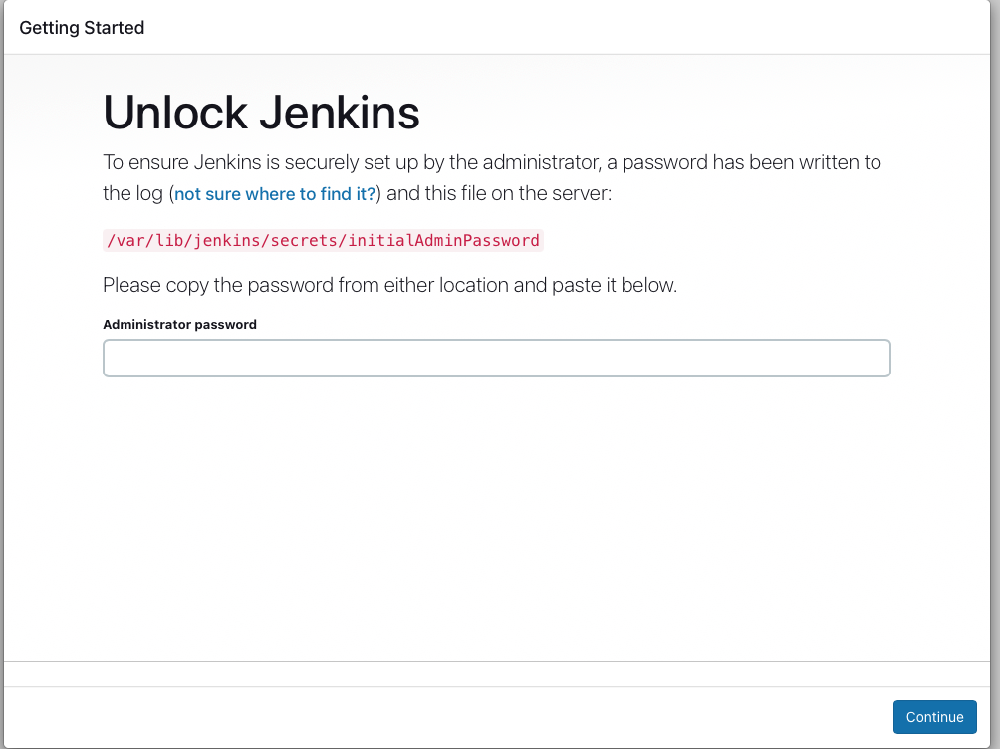
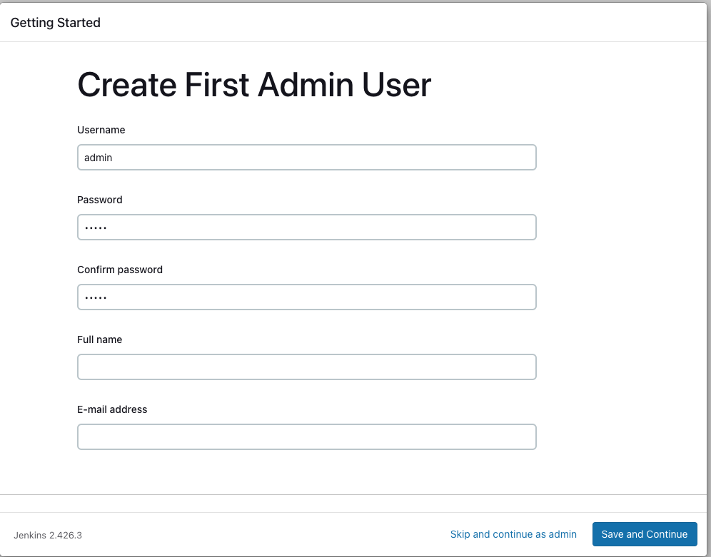
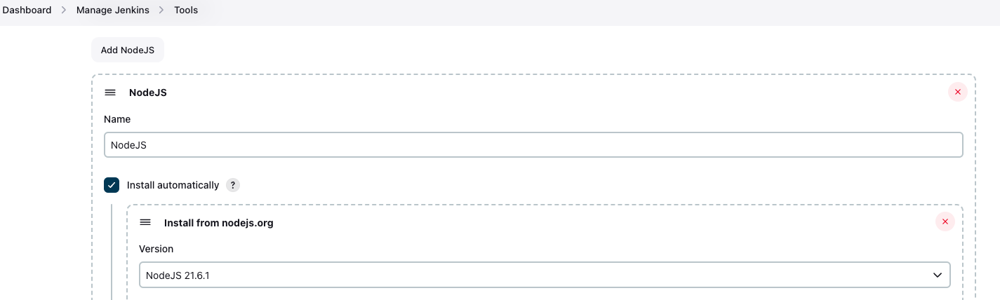
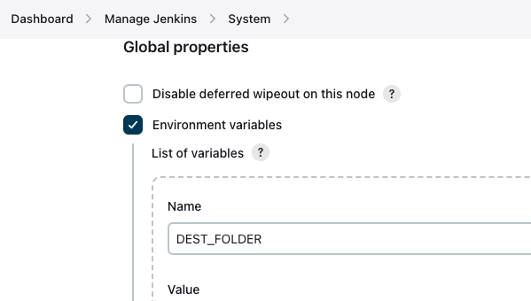
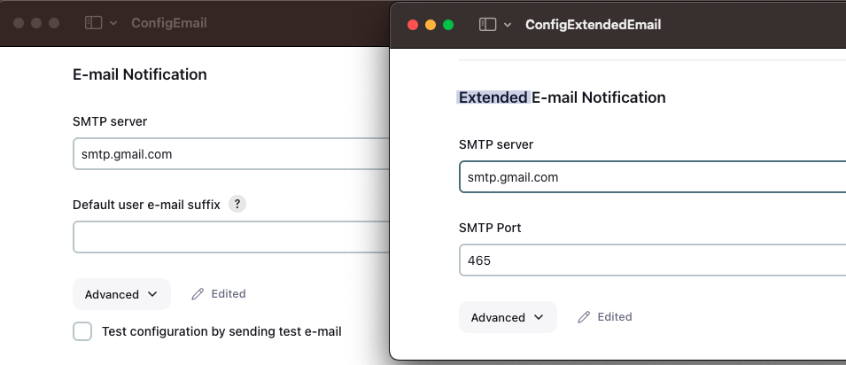
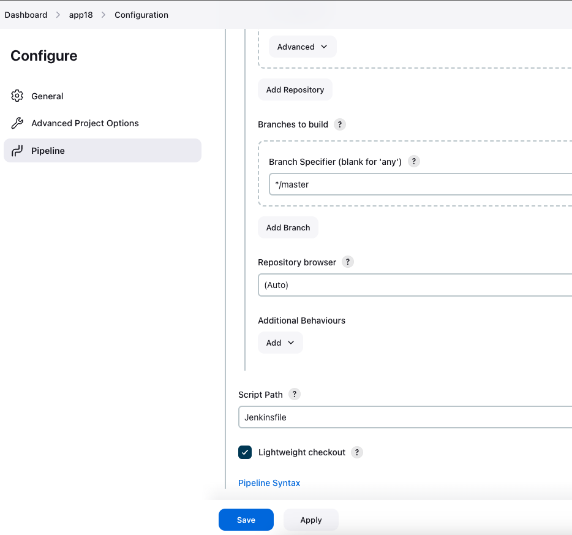
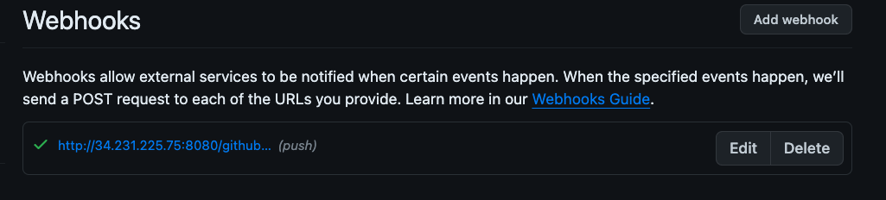
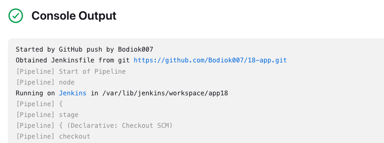

# Jenkins

## Structure

1. [Infrustructure](Infrustructure) - contains terraform files to create AWS resources.
2. [Jenkinsfile](Jenkinsfile) - to create pipeline.
3. [install-jenkins.sh](install-jenkins.sh) - to install Jenkins to server.
4. [AppToBuildAndDeploy](https://github.com/Bodiok007/18-app) - repository with app to be used by Jenkins.

## Preparation

1. Apply [Infrustructure](Infrustructure) as described [here](../TerraformIntro/ReadmeTerraformIntro.md).
2. On Jenkins machine execute `install-jenkins.sh`.
3. On App machine:
 - install NodeJS
```
sudo apt-get update
sudo apt-get install nodejs npm -y
```
- install PM2
```
sudo npm install pm2 -g
```

## Pipeline stages

1. `Checkout` - clears workspace and pulls files from repository.
2. `Build` - builds app and creates artifacts.
3. `Test` - runs tests.
4. `Deploy` - deployes to App server.

After every build e-mail notification will be sent with:
 - status
 - link to build
 - logs

## Workflow

1. Get password for Jenkins on first run.


2. Create user.


3. Install recommended plugins.

4. Install additionally NodeJS plugin and setup it in Tools.


5. Add variables and credentials.


6. Configure e-mails.


7. Create pipeline based on [Jenkinsfile](Jenkins/Jenkinsfile).


8. Configure web hook on github.


9. Commit new change and check if build triggered.

