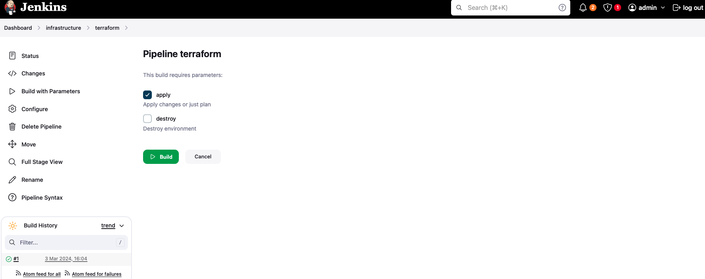
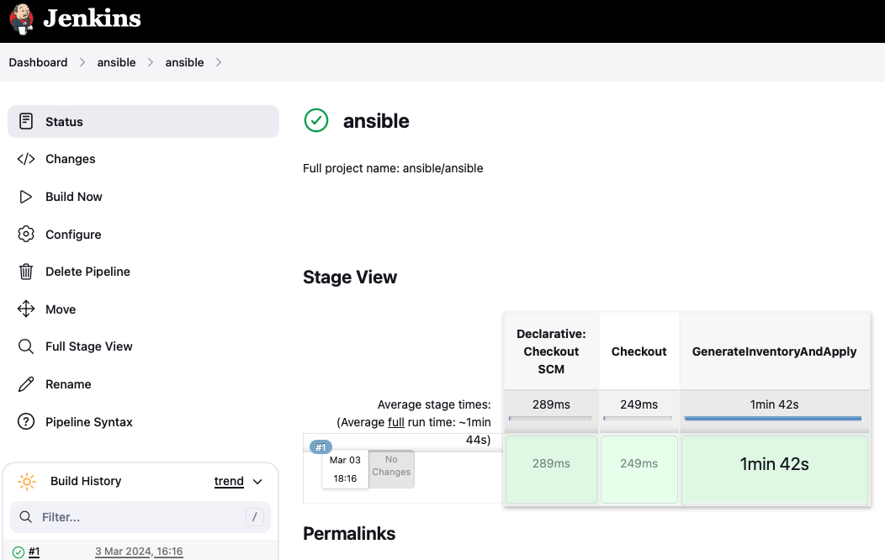
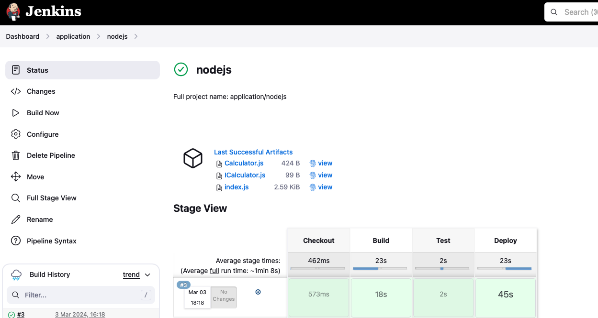
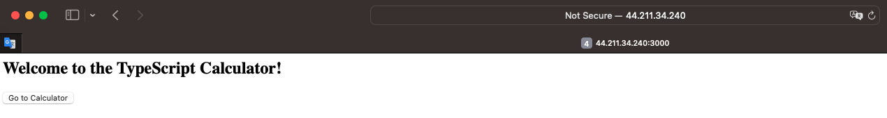

# TerraformAndAnsibleWithJenkins

## Infrustructure

1. [TerraformStart](TerraformStart) - to create Jenkins server:
- s3 - to create S3 bucket to keep there terraform state
- ec2-instance/security-group/vpc modules - to create AWS infrustructure

2. [AnsibleStart](AnsibleStart) - to configure Jenkins server:
- ansible role - allows to run Ansible from pipeline of Jenkins
- aws_cli role - allows to use AWS CLI from pipeline of Jenkins
- jenkins role - installs and setups Jenkins

3. [TerraformApp](https://github.com/Bodiok007/TerraformAppForJenkins) - to create App server:
- ec2-instance/security-group/vpc modules - to create AWS infrustructure
- [terraform.Jenkinsfile](https://github.com/Bodiok007/TerraformAppForJenkins/blob/main/terraform.Jenkinsfile) - pipeline configuration

4. [AnsibleApp](https://github.com/Bodiok007/AnsibleForJenkins) - to configure App server:
- install_soft - install software needed to run application
- [ansible.Jenkinsfile](https://github.com/Bodiok007/AnsibleForJenkins/blob/main/ansible.Jenkinsfile) - pipeline configuration

5. [App](https://github.com/Bodiok007/AppForJenkins) - app itself and related pipeline configuration [app.Jenkinsfile](https://github.com/Bodiok007/AppForJenkins/blob/main/app.Jenkinsfile) to build, test and deploy app.

## Workflow

### TerraformStart

1. Create S3 Bucket and Jenkins infrustructure on AWS by applying [instruction](../TerraformModules/ReadmeTerraformModules.md) to [TerraformStart](TerraformStart)

This will create `inventory.ini` file from [inventory.tmpl](../TerraformStart/inventory.tmpl) with section and related host configuration in [AnsibleStart](AnsibleStart):
- `[jenkins]` - jenkins server

### AnsibleStart

1. Put your private `DevOps-key.pem` (public part of which is already on server) to [AnsibleStart](AnsibleStart).

2. Run playbook and specify you values for `jenkins_admin_username` and `jenkins_admin_password`:

```
ansible-playbook jenkins-playbook.yml \
     -i inventory.ini \
     --extra-vars 'jenkins_admin_username=admin' \
     --extra-vars 'jenkins_admin_password=password1221!' \
     --diff
```

Variable `jenkins-ip` will be automatically defined from `inventory.ini`.

3. Set values to `devops-ssh-key`, `AWS_ACCESS_KEY_ID`, `AWS_SECRET_ACCESS_KEY` on Manage Jenkins -> System -> Credentials -> System -> Global credentials (unrestricted) properties section.

### TerraformApp

1. Open Jenkins and run terraform pipeline for first time after what Build with Parameters will be available.
2. Then one once again Build with Parameters and check Apply option.



3. Update `REMOTE_HOST` with IP of host created from previous step on: Manage Jenkins -> System -> Global properties section.

### AnsibleApp

1. Open Jenkins and run ansible pipeline.



### App

1. Open Jenkins and run app pipeline.



2. Check if app is available.


