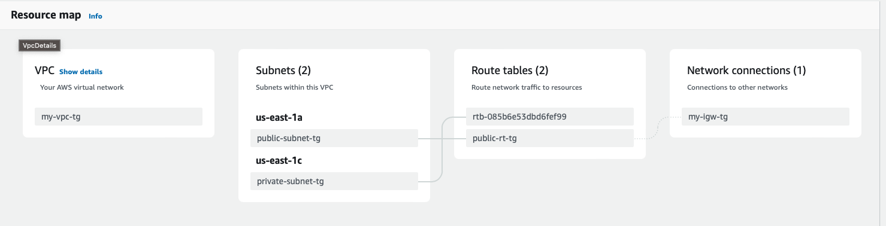

# Terraform Intro

## Infrustructure



## Preparing

Before applying - secret keys of AWS needs to be set up.
Can be done in next ways:

1. In provider:
```
provider "aws" {
  # access_key = ""
  # secret_key = ""
  region = "us-east-1"
}
```

2. Exported as variables:
```
export AWS_ACCESS_KEY_ID=""
export AWS_SECRET_ACCESS_KEY_ID=""
```

3. Set up in AWS CLI:
```
aws configure
```

## Workflow

1. Init:
```
terraform init
```

2. Plan (optional):
```
terraform plan
```

3. Apply:
```
terraform apply
```

4. Destroy:
```
terraform destroy
```
